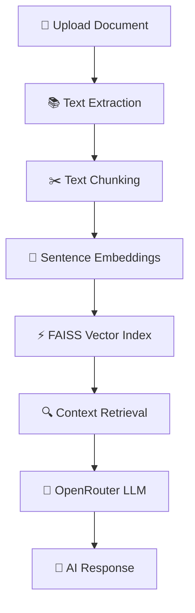
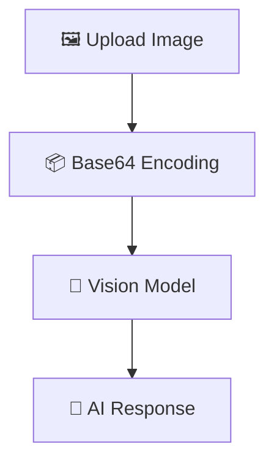

<div align="center">

# 🚀 Universal Multimodal AI Workspace

### 🤖 Chat with Documents • 🖼️ Understand Images • 🧠 AI-Powered Insights


---

## 🌟 One Platform • Infinite Intelligence

📄 Document Understanding  
🖼️ Vision Analysis  
🔍 Semantic Search  
⚡ Lightning Fast Retrieval  
🧠 Context-Aware AI Conversations

</div>

---

# 🌌 Project Overview

> 💡 **Universal Multimodal AI Workspace** is an advanced AI platform that combines **Document Retrieval-Augmented Generation (RAG)** and **Computer Vision** into a single interactive workspace.

The application enables users to:

✅ Upload PDF, DOCX, and PPTX documents

✅ Generate AI-powered executive summaries

✅ Perform semantic document search

✅ Ask contextual questions about uploaded documents

✅ Upload images and chat with them using AI Vision

✅ Save and manage conversation sessions

✅ Retrieve information using vector embeddings and FAISS

---

# 🎯 Why This Project?

Traditional AI chatbots often lack context and cannot understand uploaded documents efficiently.

This project solves that problem by introducing:

- 📚 Context-Aware Document Understanding
- ⚡ Fast Semantic Search
- 🤖 AI-Powered Summarization
- 🖼️ Vision-Based Question Answering
- 🧠 Retrieval-Augmented Generation (RAG)

---

# ✨ Core Features

| 🚀 Feature | 🎯 Description |
|------------|----------------|
| 📄 Document Upload | Supports PDF, DOCX, PPTX |
| 📋 Executive Summary | AI-generated document summaries |
| 🔍 Semantic Search | Retrieve relevant information |
| 🧠 Vector Embeddings | Context-aware document understanding |
| ⚡ FAISS Indexing | High-speed similarity search |
| 💬 Document Chat | Ask questions about documents |
| 🖼️ Vision Assistant | Chat with uploaded images |
| 💾 Session Storage | Save document and image conversations |
| 🌐 OpenRouter Integration | Connect to advanced LLMs |
| 🚀 Streamlit UI | Interactive web application |

---

# 🏗️ System Architecture

## 📄 Document Processing Pipeline



## 🖼️ Vision Processing Pipeline



---

# 🧰 Technology Stack

| Technology | Purpose | Why Used |
|------------|----------|-----------|
| 🐍 Python | Backend Development | Simplicity & Flexibility |
| 🎈 Streamlit | Web Interface | Rapid AI Application Development |
| 🧠 Sentence Transformers | Embeddings | Semantic Search |
| ⚡ FAISS | Vector Database | Fast Similarity Search |
| 🌐 OpenRouter | LLM Gateway | Access to AI Models |
| 🔥 PyTorch | Deep Learning | Embedding Computation |
| 📚 PyPDF | PDF Parsing | Document Processing |
| 📝 Python-Docx | DOCX Parsing | Word File Support |
| 📊 Python-PPTX | PPT Processing | Presentation Support |
| 🖼️ Pillow | Image Processing | Vision Module |
| 🔢 NumPy | Numerical Operations | Vector Manipulation |
| 📄 Streamlit PDF Viewer | PDF Preview | Embedded Viewing |

---

# 📂 Project Structure

```text
Universal-Multimodal-AI-Workspace/
│
├── 📄 app.py
├── 📦 requirements.txt
├── 🔐 .env
├── 📘 README.md
│
├── 📂 assets/
│   ├── screenshots/
│   └── diagrams/
│
└── 📂 data/
```

### 📄 app.py

Main application containing:

- Streamlit UI
- Document RAG Pipeline
- Vision Assistant
- Session Management
- OpenRouter Integration

### 📦 requirements.txt

Contains all Python dependencies.

### 🔐 .env

Stores sensitive API keys.

### 📘 README.md

Project documentation.

---

# ⚙️ Installation Guide

## ① Clone Repository

```bash
git clone https://github.com/yourusername/Universal-Multimodal-AI-Workspace.git
```

```bash
cd Universal-Multimodal-AI-Workspace
```

---

## ② Create Virtual Environment

```bash
python -m venv venv
```

---

## ③ Activate Virtual Environment

### Windows

```bash
venv\Scripts\activate
```

### Linux / Mac

```bash
source venv/bin/activate
```

---

## ④ Install Dependencies

```bash
pip install -r requirements.txt
```

---

## ⑤ Configure Environment Variables

Create a `.env` file:

```env
OPENROUTER_API_KEY=your_api_key_here
```

---

## ⑥ Run Application

```bash
streamlit run app.py
```

---

# 🔐 Environment Variables

| Variable | Description |
|-----------|------------|
| OPENROUTER_API_KEY | OpenRouter API Key |

### Obtain API Key

1. Visit OpenRouter
2. Create an account
3. Generate API Key
4. Add key inside `.env`

---

# 🧠 How Retrieval-Augmented Generation (RAG) Works

<details>

<summary>🚀 Click to Expand</summary>

### Step 1

📄 Upload Document

### Step 2

📚 Extract Text

### Step 3

✂️ Split Text into Chunks

### Step 4

🧠 Generate Embeddings

### Step 5

⚡ Store Embeddings in FAISS

### Step 6

🔍 Retrieve Relevant Context

### Step 7

🤖 Send Context + Query to LLM

### Step 8

💬 Generate Context-Aware Response

</details>

---

# 🤖 AI Models Used

## 🧠 Embedding Model

### all-MiniLM-L6-v2

Used for:

- Semantic Search
- Context Retrieval
- Similarity Matching
- Embedding Generation

---

## 🌐 OpenRouter LLM

Used for:

- Question Answering
- Summarization
- Vision Analysis
- Conversational AI

---

# 📸 Screenshots

## 🏠 Dashboard

```text
Insert Dashboard Screenshot Here
```

## 📄 Document Upload

```text
Insert Document Upload Screenshot Here
```

## 📋 Summary Generation

```text
Insert Summary Screenshot Here
```

## 💬 Document Chat

```text
Insert Chat Screenshot Here
```

## 🖼️ Vision Assistant

```text
Insert Vision Screenshot Here
```

---

# 🚀 Future Roadmap

- 📑 OCR Support
- 🌍 Multi-Language Support
- ☁️ Cloud Deployment
- 🔐 User Authentication
- 📚 Multi-Document Retrieval
- 📖 Citation-Based Responses
- 🎤 Audio Understanding
- 🎥 Video Analysis
- ⚡ Streaming Responses
- 🗄️ Persistent Vector Database

---

# 🛡️ Security Considerations

### 🔐 API Key Protection

Store all secrets inside `.env`.

### 📁 Secure File Processing

Uploaded files remain session-based.

### 🧠 Session Isolation

Independent document and image sessions.

### 🚫 Secret Exposure Prevention

Never hardcode API keys.

---

# ⚡ Performance Optimizations

### 🚀 Cached Models

Embedding model loads once.

### ⚡ FAISS Retrieval

Fast vector similarity search.

### 🔥 Optimized Thread Usage

Reduces CPU thrashing.

### 📦 Lightweight Embeddings

Efficient memory usage.

---

# 🐞 Troubleshooting

## OpenRouter API Error

Verify:

```env
OPENROUTER_API_KEY
```

is configured correctly.

---

## FAISS Installation Issue

```bash
pip install faiss-cpu
```

---

## PDF Extraction Failure

Ensure PDF contains selectable text.

---

## Image Upload Issues

Supported:

- PNG
- JPG
- JPEG

---

# 🤝 Contributing

Contributions are welcome!

1. Fork Repository
2. Create Feature Branch
3. Commit Changes
4. Push Branch
5. Open Pull Request

---

# 📜 License

This project is licensed under the **MIT License**.

---

<div align="center">

# 👨‍💻 Author

### 💎 Developed with Passion for AI & Innovation

⭐ If you found this project useful, please consider giving it a star!

🚀 Happy Coding!

</div>
